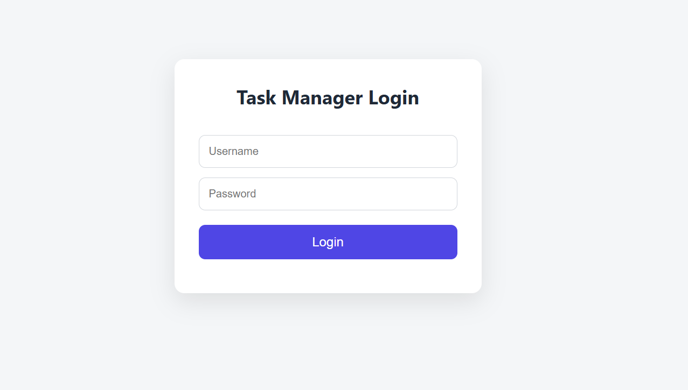
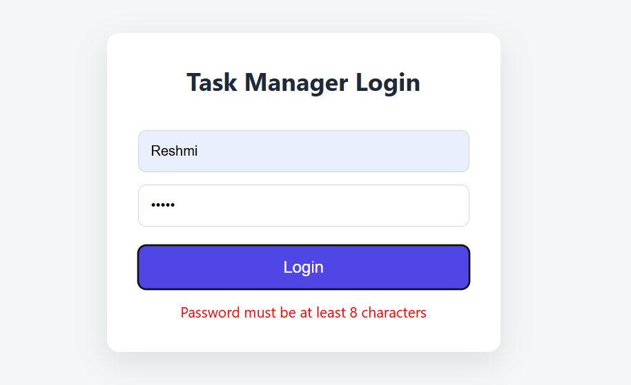
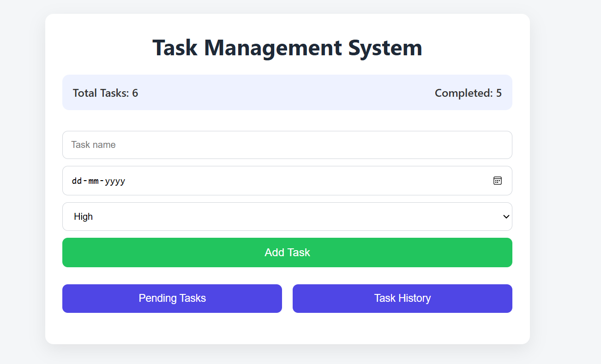
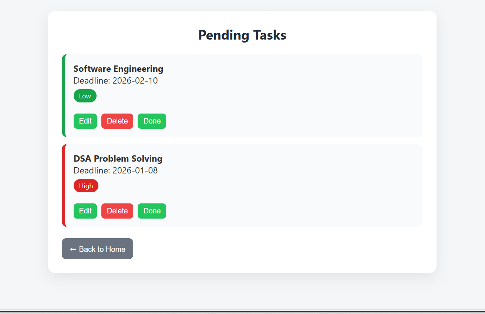
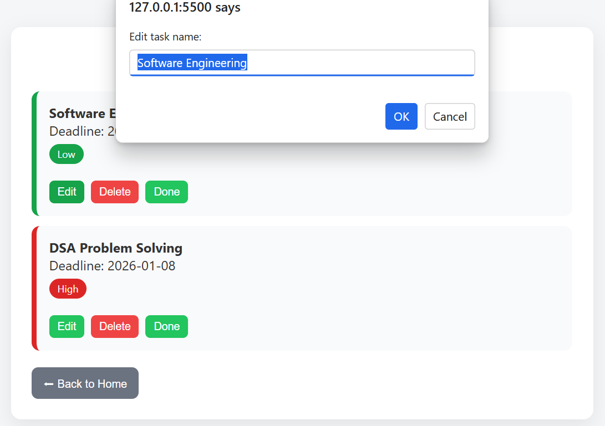
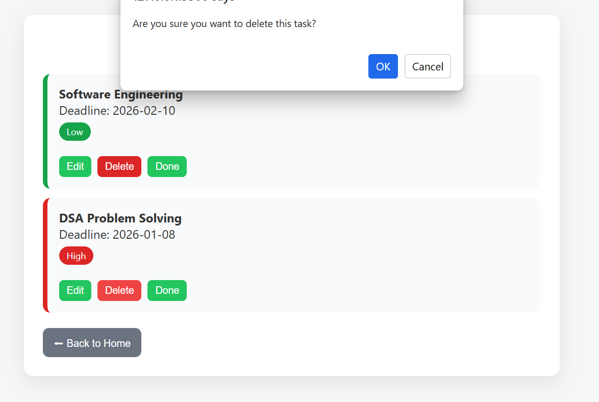
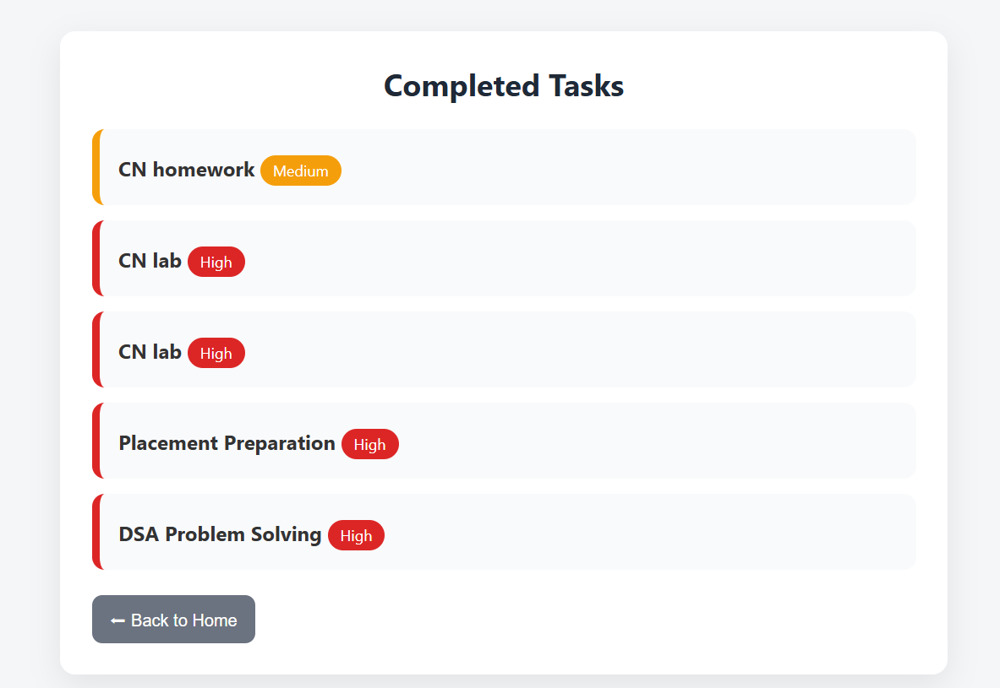

# ✅ Task Management System 🗂️✨

A clean and professional **frontend Task Management Web Application** built using **HTML, CSS, and JavaScript**.  
This project helps users organize tasks efficiently with priority tracking, task history, and a simple login system.

## 🚀 Project Overview

The **Task Management System** allows users to:
- Log in with basic validation
- Create tasks with deadline & priority
- View pending tasks separately
- Track completed tasks in history
- Edit or delete tasks easily
- Experience a clean and responsive UI

This project focuses on **real-world frontend development concepts** without using any backend.

## 🛠️ Technologies Used

- 🧱 **HTML** – Page structure
- 🎨 **CSS** – Styling, layout & responsiveness
- ⚙️ **JavaScript** – Logic & interactivity
- 💾 **LocalStorage** – Data persistence

## 📂 Project Structure

task-manager/
├── login.html 🔐 Login page
├── home.html 🏠 Dashboard
├── pending.html ⏳ Pending tasks
├── history.html 📜 Completed tasks
├── style.css 🎨 Styling
└── script.js ⚙️ Functionality

## 🔐 Login Features

- Username **must not be empty**
- Password must be **at least 8 characters**
- Successful login redirects to the Home page
- Unauthorized access is restricted

## 🏠 Home Page Features

- ➕ Add new tasks
- 📝 Task name, deadline & priority input
- 🔄 Navigation to:
  - **Pending Tasks**
  - **Task History**
- 🧹 Clean and clutter-free UI

## ⏳ Pending Tasks Page

- Displays all **incomplete tasks**
- 🏷️ Priority tags:
  - 🔴 High
  - 🟠 Medium
  - 🟢 Low
- ✏️ Edit task
- 🗑️ Delete task
- ✅ Mark task as completed

## 📜 Task History Page

- Displays all **completed tasks**
- Read-only view (no edit/delete)
- Automatically updated when a task is completed

## 💾 Data Storage

- Tasks are stored using **LocalStorage**
- Data persists even after page refresh
- No backend or database required

## 📱 Responsive Design

- Works on **desktop, tablet, and mobile**
- Clean layout using modern CSS
- User-friendly and professional UI

## 🎯 What I Learned From This Project

- DOM manipulation using JavaScript
- Handling user input & validation
- CRUD operations (Create, Read, Update, Delete)
- Page navigation & session handling
- Using LocalStorage for state management
- Building real-world frontend applications

## 🧠 Future Enhancements

- 🔍 Search & filter tasks
- 🚪 Logout functionality
- 🌙 Dark mode
- ⚛️ React version of the project
## 📸 Project Screenshots
## 📸 Project Screenshots

### 🔐 Login Page

**Login Validation**

### 🏠 Home Page

**Calendar & Task Input**

### ⏳ Pending Tasks Page

**Edit Task**

**Delete Task**

### 📜 Task History Page

## 📌 Conclusion

This project helped me strengthen my **frontend development skills** by building a real-world, user-friendly task management system with clean UI and proper logic separation.

### 🙌 Thank you for checking out my project!
